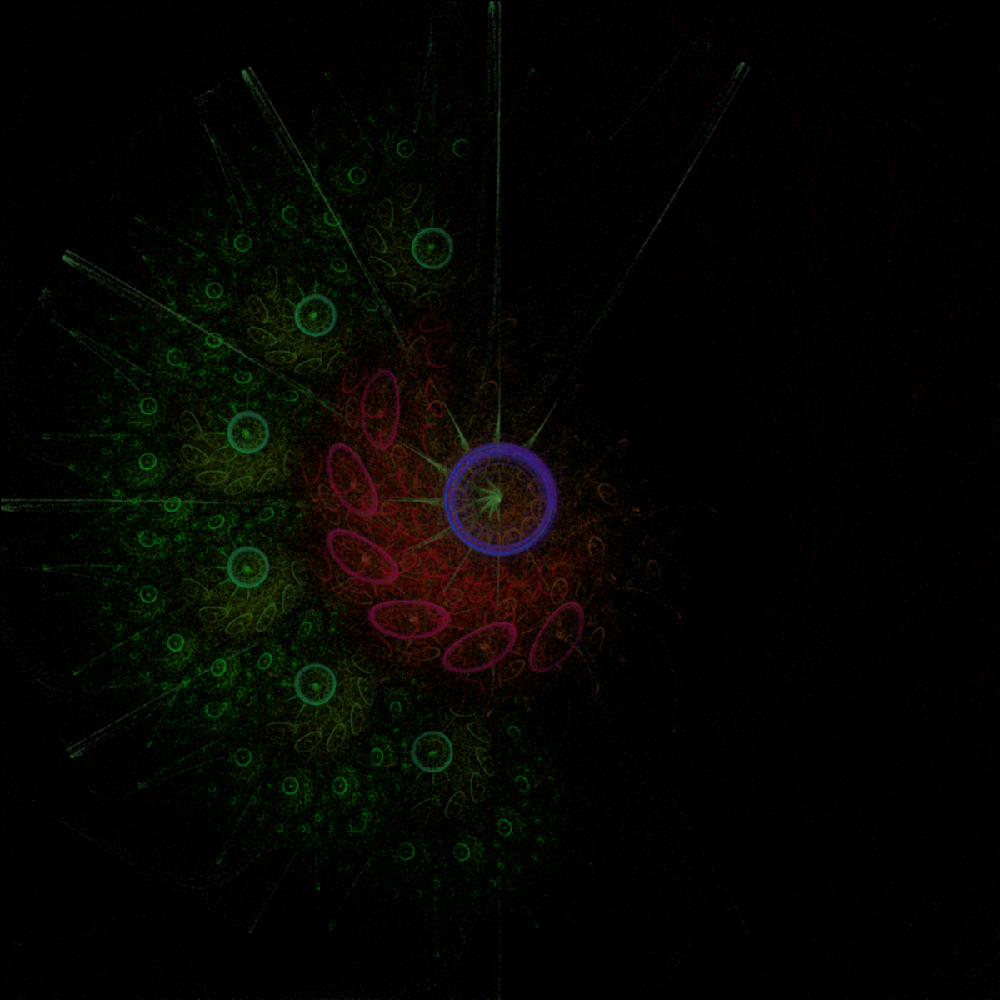

# FlamePython2

<center> </center>


Second version of the Flame Fractals in Python - inspired by Draves and Reckase (http://flam3.com/flame_draves.pdf)

I tried to make it easy to add Functions and Variations to the Fractales. 

### UserGuide Example

```
  F1=Fractale(burn=10,niter=20,zoom=1)
```
Declaration of a fractale object. It will run "burn" times without saving the points, then run "niter" times saving the points. 
The zoom parameter is just for convenience.

```
  v1=Variation()
  v1.addFunction([.5],[0,1,0,0,0,1],['linear'],.2,[255,0,0])
  v1.addFunction([.5],[1,1,0,0,0,1],['linear'],.2,[0,255,0])
  v1.addFunction([.5],[0,1,0,1,0,1],['linear'],.2,[0,0,255])
```

Here we declare a variation with 3 functions. For instance this will give a Serpinski's triangle as the functions are:

F_0(x,y)=(x/2,y/2)

F_1(x,y)=((x+1)/2,y/2)

F_2(x,y)=(x/2,(y+1)/2)

Each function has a different color. They also have the same probability to appear (the probs are normalised to sum to one).

We then add the variation to the Fractale object, with 50k points.
```
	F1.addVariation(v1,50000)
```

We can then build the fractale and run it!
```
	F1.build()
	F1.runAll()
```
This is pretty fast. The coslty part is to go from the coordinate space to the image space:
```
	out=F1.toImage()
```

Saving is pretty fast:
```
  out.save("figure.png")
```

Taddaaa!


