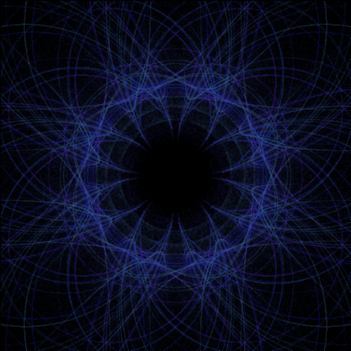
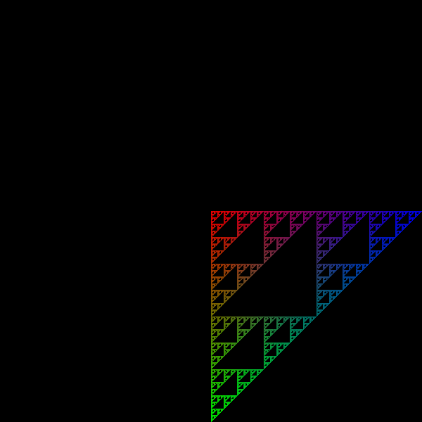

# FlamePython2

This is a Python implementation of the [Flames Fractals](http://flam3.com/flame_draves.pdf) algorithm.

The Fractal Flame algorithm is a two-dimensional Iterated Function System (IFS) that creates images by plotting the output of an attractor on the image plane. This algorithm is distinguished by its use of non-linear functions, log-density display, and structural coloring, which together result in a wide range of visually interesting images.

To use this implementation, clone the repository and follow the instructions in the README.md file within the repository. 

<p align="center"> </p>


### Generating a video

To generate a video, run the following command:

```bash
python src/helpers.py 
```

After some computation time, a video will be saved locally.


### UserGuide Example

```
import class_fractale.py
burn = 20
niter = 50
zoom = 1
N = 10000

F1 = Fractale(burn, niter, zoom)

```
Declaration of a fractale object. It will run "burn" times without saving the points, then run "niter" times saving the points. 
The zoom parameter is just for convenience. These are not parameters you should play with as a start.

```
a1 = np.array([0, 1, 0, 0, 0, 1])
a2 = np.array([1, 1, 0, 0, 0, 1])
a3 = np.array([0, 1, 0, 1, 0, 1])
```
These vectors will be used further in the Functions. You can modify these values but as a rule of thumb you should keep the values between 1.2 and -1.2.


```
v1 = Variation()
v1.addFunction([.5], a1, [linear], .2, [255, 0, 0])
v1.addFunction([.5], a2, [linear], .2, [0, 255, 0])
v1.addFunction([.5], a3, [linear], .2, [0, 0, 255])

```

Here we declare a Variation with 3 Functions. For instance, with the values of `a`s this will give a Serpinski's triangle.

Each Function has a number of scales (here the first parameter that still needs to be in a list). It also has a vector (one of the `a`s).
Then it has some additives (here it's `linear`). You can add additives (see `utils.py` for the ones that are implemented) but more than 3 additives per Function gives messy images. 
Then one can see that the Functions also have the same probability to appear (0.2, but the probs are normalised to sum to one).
Finally, each Function has a different color (the last list of 3 values). 


We then add the variation to the Fractale object, with N points.
```
F1.addVariation(v1, N)

```

We can then build the fractale and run it!
```
F1.build()
F1.runAll()
   
```
This is pretty fast. The coslty part is to go from the coordinate space to the image space:
```
print("Generating the image")
out = F1.toImage(600, optional_kernel_filtering=False)
   
```

Saving is pretty fast:
```
out.save("serp.png")
```

<p align="center"> </p>

