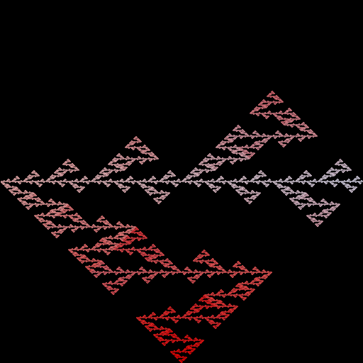
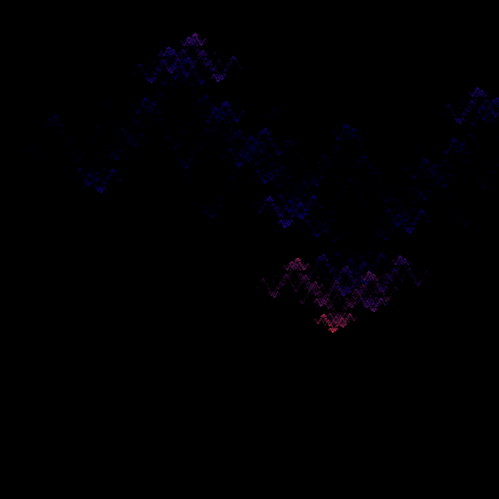
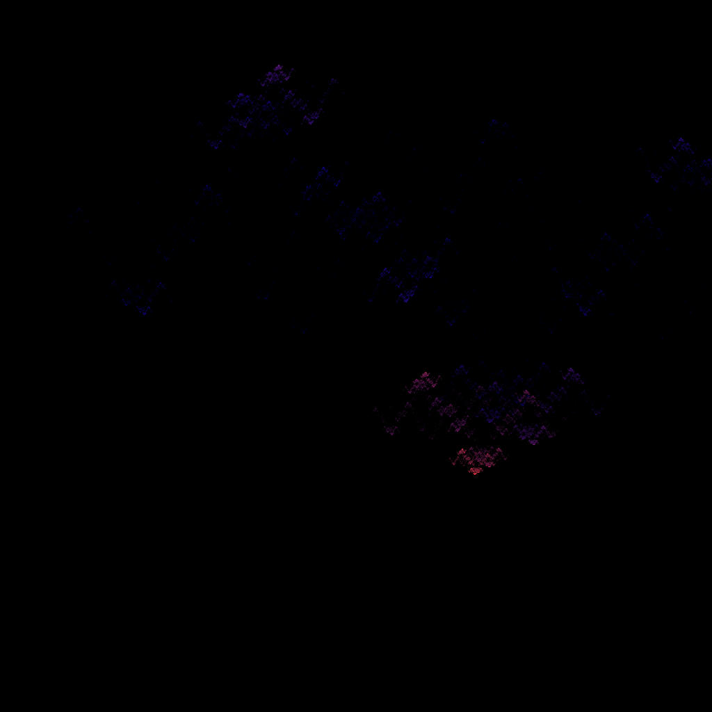
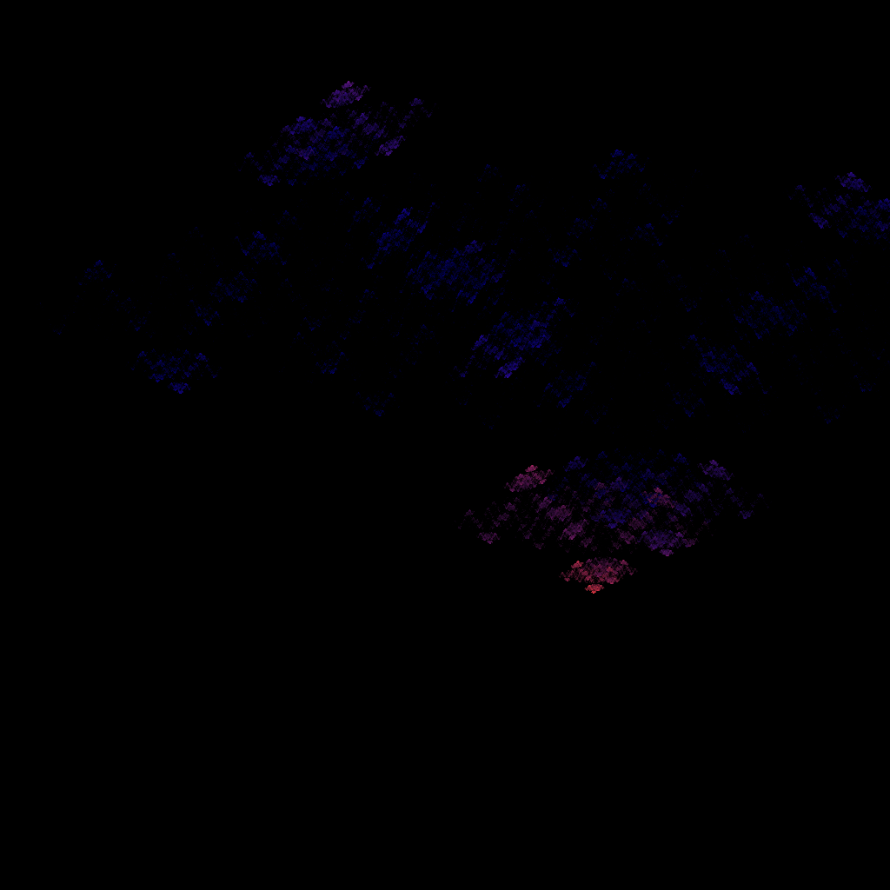
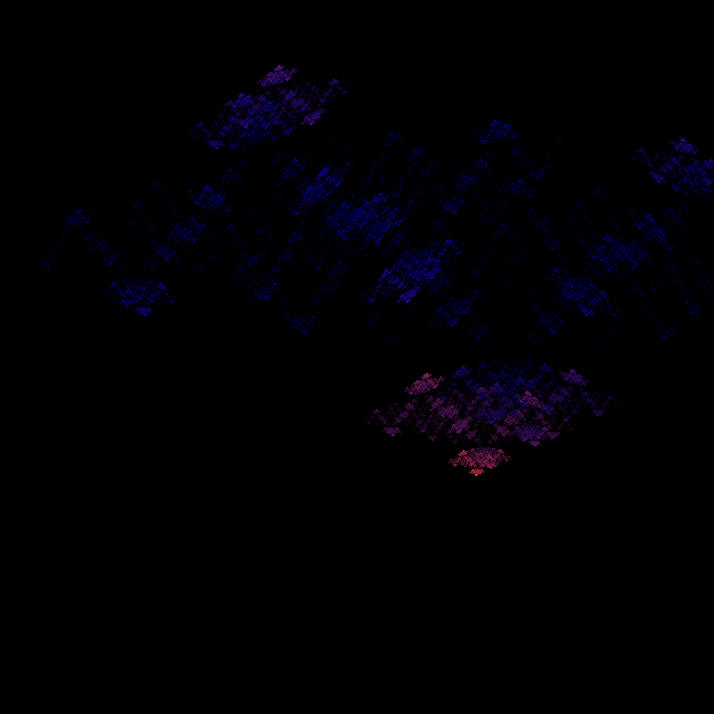

# FlamePython2

This is a Python implementation of the [Flames Fractals](http://flam3.com/flame_draves.pdf) algorithm.

The Fractal Flame algorithm is a two-dimensional Iterated Function System (IFS) that creates images by plotting the output of an attractor on the image plane. This algorithm is distinguished by its use of non-linear functions, log-density display, and structural coloring, which together result in a wide range of visually interesting images.

To use this implementation, clone the repository and follow the instructions in the README.md file within the repository. 

<p align="center"> </p>


## Generating an image

To generate an image, use the `GenerateImages.py` script.
It will generate the following image:

<p align="center"> </p>

The code creates an `ImageHolder` object of type `Sierpinskies`.


Parameters are: 
- `i`: the index of the image
- `n_im`:  the total number of images - useful for video
- `size`:  the size in pixels of the image to save
- `name`: the name of the folder and basename for the image

### Creating your own ImageHolder

The best way is to start from a simple existing `ImageHolder`, such as `Sierpinski` that creates a red-white Sierpinski triangle. One just needs to implement the `create_variation` function.

At the core of this function, a `Variation` object is created, taking as parameters:
- a `list` of `Function` objects
- an int `burn_steps` or number of times that the iterative functions are called but the results are not stored. 10-15 is usually a good default. a lower number can mean more blurry images.
- an int `iterate_steps` that is the number of iterations that are stored, a higher number means more computing time but brighter images / more converged images.
- an int `N` that is the number of points on which the functions are applied  `iterate_steps` times. A higher number means brighter images / more converged images. This parameter has the most impact on generating time. 15000 is a good default value for experimenting, that can be gradually increased.

| Image | Description |
|-------|-------------|
|  | Image with N=15k points |
|  | Image with N=150k points |
|  | Image with N=1.5M points |


## Generating a video

To generate a video, use the `VideoGenerator.py` file, that contains the `VideoGenerator` object. That object takes an `ImageHolder` child class as argument.

An example:

```python
video_generator = VideoGenerator(SierpinskiesWithLFOs)
video_generator.do_video_with_IH(fps=25, 
                                 duration=10, 
                                 size=512, 
                                 name="SierpinskiesWithLFOs", 
                                 nb_jobs=-3,
                                 output_format="gif")
```

This creates a video from the `VideoGenerator` object based on the `SierpinskiesWithLFOs`, that inherits from the abstract class `ImageHolder`. That video will have `25` fps, a duration of `10` seconds. It will generate 250 images from the `SierpinskiesWithLFOs` object, each with a different ratio. The images will have a  `512x512` pixels size. The video will be named `SierpinskiesWithLFOs.gif` and will be executed in parallel with the `nb_jobs` parallel executions argument.

<p align="center"> </p>


### Adding an additive to the ImageHolder

File `SWLFOsMA.py` includes an example with one more additive at the first function. 


### Next steps

- Document the `Function` parameters