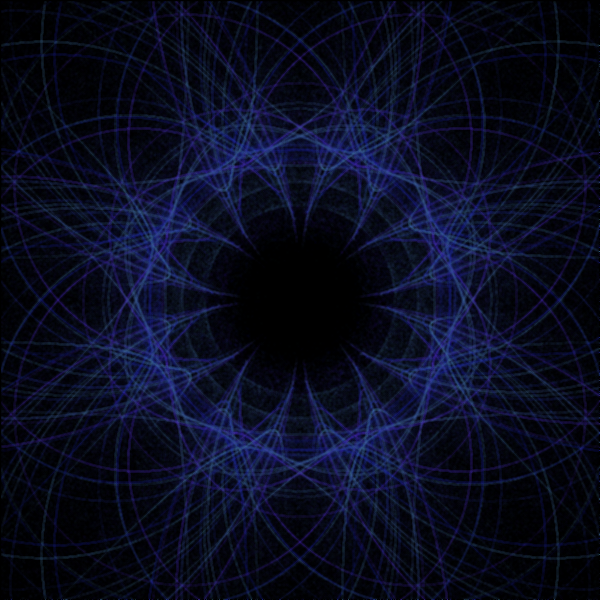
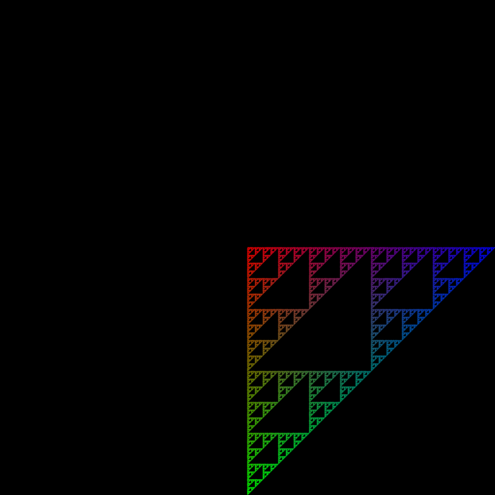

# FlamePython2

<center> </center>

Second version of the Flame Fractals in Python - inspired by Draves and Reckase (http://flam3.com/flame_draves.pdf)

I tried to make it easy to add Functions and Variations to the Fractales. 

### UserGuide Example

```
burn = 20
niter = 50
zoom = 1
N = 10000

a1 = np.array([0, 1, 0, 0, 0, 1])
a2 = np.array([1, 1, 0, 0, 0, 1])
a3 = np.array([0, 1, 0, 1, 0, 1])

F1 = Fractale(burn, niter, zoom)

```
Declaration of a fractale object. It will run "burn" times without saving the points, then run "niter" times saving the points. 
The zoom parameter is just for convenience.

```
v1 = Variation()
v1.addFunction([.5], a1, [linear], .2, [255, 0, 0])
v1.addFunction([.5], a2, [linear], .2, [0, 255, 0])
v1.addFunction([.5], a3, [linear], .2, [0, 0, 255])

```

Here we declare a variation with 3 functions. For instance this will give a Serpinski's triangle.

Each function has a different color. They also have the same probability to appear (the probs are normalised to sum to one).

We then add the variation to the Fractale object, with N points.
```
F1.addVariation(v1, N)

```

We can then build the fractale and run it!
```
F1.build()
F1.runAll()
   
```
This is pretty fast. The coslty part is to go from the coordinate space to the image space:
```
print("Generating the image")
out = F1.toImage(600, optional_kernel_filtering=False)
   
```

Saving is pretty fast:
```
out.save("serp.png")
```

Taddaaa!



